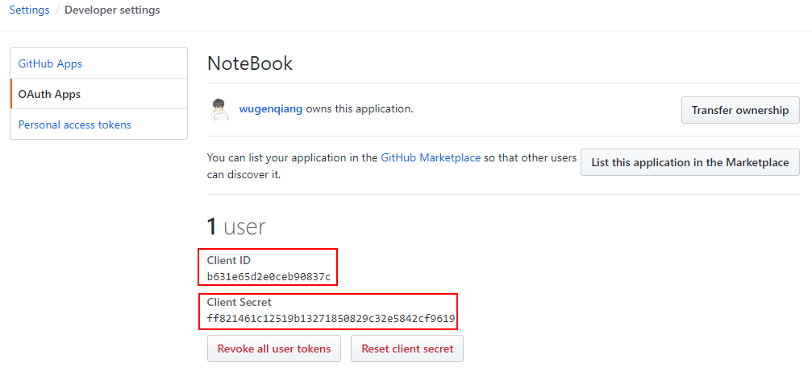

### 安装使用

#### 快速安装

```npm
npm i docsify-cli -g
```

#### 初始化文档目录

```docsify
docsify init
```

**文档目录**说明

* `.nojekyll`：告诉 GitHub Pages 服务该站点不使用`Jekyll`作为构建工具
* `index.html`：入口文件
* `README.md`：作为首页渲染

#### 运行文档

```docsify
docsify serve
```

通过[http://localhost:3000/](http://localhost:3000/)来访问你的文档站点

### 站点配置

#### 站点标题

> 站点标题修改 `index.html` 里的 `title` 标签即可

```html
<title>站点标题</title>
```

#### 站点图标

> 站点图标要在 `index.html` 添加以下代码

```html
<link rel="icon" href="favicon.jpg" />
```

**或者**使用

```html
<link rel="shortcut icon" href="favicon.ico" />
```

**注意**： `favicon.ico` 文件放在网站根目录

#### 站点封面

> 在 `index.html` 页面，给站点设置一个封面

```html
<script>
    window.$docsify = {
        name: "...",
        repo: "...",
        coverpage: true,
    };
</script>
```

> 封面由 `_coverpage.md` 来渲染，默认无该文件, 需自己创建，添加如下内容

```markdown


# 自定义内容

> 自定义内容

- 自定义内容

[开始阅读](/README)
```

#### 导航栏

> 在 `index.html` 页面添加导航栏

```html
<script>
    window.$docsify = {
        name: "...",
        repo: "...",
        loadNavbar: true,
    };
</script>
```

> 默认没有 `_navbar.md` 文件，新建一个即可，添加如下内容

```markdown
- [Home](/)
- Links
  - [页面名称](URL路径)
```

#### 侧边栏

> 在 `index.html` 页面添加侧边栏

```html
<script>
    window.$docsify = {
        name: "...",
        repo: "...",
        loadSidebar: true,
    };
</script>
```

> 默认没有 `_sidebar.md` 文件，新建一个即可，添加如下内容

```markdown
- [一](URL)
- 二
  - [三](URL)
```

**注意**：实际使用中可以不开启侧边栏，直接通过文档生成侧边栏

#### 页脚信息

> 由于官方未提供页脚设置，只能通过编写插件方式实现，这里提供参考代码，在 `index.html` 页面加入即可

**注意：**页脚功能也可以通过页脚插件实现，但无法在页脚展示网站运行时间功能，[页脚插件](/?id=底部页脚)。

```html
<script>
    plugins: [
        function(hook) {
            var footer = [
                '<hr/>',
                '<footer>',
                '<span><a href="https://www.docsify.com">docsify</a> &copy;2017.</span>',
                '<span>docsify文档使用<a href="https://github.com/QingWei-Li/docsify" target="_blank"> docsify </a>撰写.</span>',
                '</footer>'
            ].join('')
            hook.afterEach(function(html) {
                return html + footer
            })
        }
    ]
</script>
```

#### 网站运行时间

> 官方未提供本人自创方法，只要在页脚信息Js里如下代码即可。

**注意：**如何页脚功能通过页脚插件实现，网站运行时间功能则无法使用，页脚插件使用具体参考，[页脚插件](/?id=底部页脚)。

```html
<script>
    //页脚信息
    function(hook) {
        var seconds = 1000;
        var minutes = seconds * 60;
        var hours = minutes * 60;
        var days = hours * 24;
        var years = days * 365;
        var today = new Date();
        var todayYear = today.getFullYear();
        var todayMonth = today.getMonth() + 1;
        var todayDate = today.getDate();
        var todayHour = today.getHours();
        var todayMinute = today.getMinutes();
        var todaySecond = today.getSeconds();
        var t1 = Date.UTC(2004, 11, 16, 00, 00, 00); //这里设置网站运行开始时间
        var t2 = Date.UTC(todayYear, todayMonth, todayDate, todayHour, todayMinute, todaySecond);
        var diff = t2 - t1;
        var diffYears = Math.floor(diff / years);
        var diffDays = Math.floor((diff / days) - diffYears * 365);
        var diffHours = Math.floor((diff - (diffYears * 365 + diffDays) * days) / hours);
        var diffMinutes = Math.floor((diff - (diffYears * 365 + diffDays) * days - diffHours * hours) / minutes);
        var diffSeconds = Math.floor((diff - (diffYears * 365 + diffDays) * days - diffHours * hours - diffMinutes * minutes) / seconds);
        var tSiteTime = "本站已运行" + diffYears + "年" + diffDays + "天";

        var footer = [
            "<hr/>",
            "<footer>",
            '<span><a href="https://www.docsify.org">docsify</a> &copy;2017.</span>',
            '<span>文档使用<a href="https://github.com/QingWei-Li/docsify" target="_blank">docsify</a>撰写</span>',
            '<span>&nbsp;' + tSiteTime + '</span>',
            "</footer>",
        ].join("");
        hook.afterEach(function(html) {
            return html + footer;
        });
    },
</script>
```

#### 自定义首页

> 由于官方默认首页 README.md 与 Github/Getee 自动生成的 README.md 冲突，对程序员来说 README.md 主要用来查阅代码运行帮助的，所以这里需要自定义首页。

```html
<script>
    window.$docsify = {
        homepage: "index.md",
    };
</script>
```

**注意：**index.md 为自己定义的首页

#### 自定义 404 页面

> 由于官方未提供页的 404 页简单粗暴，可以自定义 404 页，在 `index.html` 页面设置

```html
<script>
    window.$docsify = {
        notFoundPage: "404.md",
    };
</script>
```

**注意：**由于官方未提供 404 页，需要自己新建 404.md

```markdown


# 自定义错误内容

> 自定义错误内容

- 自定义错误内容

[返回](/)
```

#### 常用设置

> Loading 文字提示设置，直接在 `index.html` 页面修改即可

```html
<div id="app">加载中</div>
```

> 当切换页面时自动滚动到顶部

```html
<script>
    window.$docsify = {
        auto2top: true,
    };
</script>
```

> 设置 github 角标、引用等样式颜色

```html
<script>
    window.$docsify = {
        themeColor: "#0a8",
    };
</script>
```

> 点击菜单导航会定位到具体的标签并滚动到顶部，设置距离顶部的高度

```html
<script>
    window.$docsify = {
        topMargin: 10,
    };
</script>
```

### 主题选择

#### Vue 主题（淡绿色）

```html
<link rel="stylesheet" href="//cdn.jsdelivr.net/npm/docsify@4/lib/themes/vue.css" />
```

#### buble（淡蓝色）

```html
<link rel="stylesheet" href="//cdn.jsdelivr.net/npm/docsify@4/lib/themes/buble.css" />
```

#### dark（黑灰色）

```html
<link rel="stylesheet" href="//cdn.jsdelivr.net/npm/docsify@4/lib/themes/dark.css" />
```

#### pure（灰白色，不建议使用，但可以在此主题上更改样式，理由：容易调整）

```html
<link rel="stylesheet" href="//cdn.jsdelivr.net/npm/docsify@4/lib/themes/pure.css" />
```

#### dolphin（惹眼的淡灰绿）

```html
<link rel="stylesheet" href="//cdn.jsdelivr.net/npm/docsify@4/lib/themes/dolphin.css" />
```

#### theme-defaults（灰白色）

```html
<link rel="stylesheet" href="https://cdn.jsdelivr.net/npm/docsify-themeable@0/dist/css/theme-defaults.css" />
```

#### theme-simple （灰白色）

```html
<link rel="stylesheet" href="https://cdn.jsdelivr.net/npm/docsify-themeable@0/dist/css/theme-simple.css" />
```

#### theme-simple-dark（黑色）

```html
<link rel="stylesheet" href="https://cdn.jsdelivr.net/npm/docsify-themeable@0/dist/css/theme-simple-dark.css" />
```

### 插件挂件

#### 页面右上角 Github 挂件

> `name` 侧边栏标题， `repo` 站点的右上角挂件，点击可跳转到相应的 URL 地址。

```html
<script>
    window.$docsify = {
        name: "",
        repo: "",
    };
</script>
```

#### 底部页脚

> 在 `index.html` 页面添加底部页脚

```html
<script>
    window.$docsify = {
        name: "...",
        repo: "...",
        loadFooter: true,
        // loadFooter: '_footer.md',//底部文件可以通过此方法自定义
    };
</script>

<script src="//cdn.jsdelivr.net/npm/@alertbox/docsify-footer/dist/docsify-footer.min.js"></script>
//或者
<script src="//cdn.jsdelivr.net/npm/@alertbox/docsify-footer@1.0.0-0/dist/docsify-footer.min.js"></script>
```

**注意：** 默认没有 `_footer.md` 文件，新建一个即可，添加如下内容

```markdown
2012-2021  版权所有 © [Site.com](https://www.site.com) All Rights Reserved [沪ICP备8888888号-10](https://1)
```

#### 站点页面出现爱心

> 在点击页面的时候出现爱心

```html
<script src="//cdn.jsdelivr.net/gh/jerryc127/butterfly_cdn@2.1.0/js/click_heart.js"></script>
```

#### 外链脚本

> 在调用第3方插件时有时候需要开启引用外链脚本功能

**注意：** `这点很重要`

```html
<script src="//cdn.jsdelivr.net/npm/docsify/lib/plugins/external-script.min.js"></script>
```

#### 回到顶部

> 在 `index.html` 引入Js和配置参数。

```html
<script>
    window.$docsify = {
        name: '...',
        repo: '...',
        scrollToTop: {
            auto: true,
            text: 'Top',
            right: 15,
            bottom: 15,
            offset: 300
        }
    }
</script>
<script src="//unpkg.com/docsify-scroll-to-top/dist/docsify-scroll-to-top.min.js"></script>
```

#### 搜索插件

> 在 `index.html` 里添加 search 属性以及 Js 文件

```html
<script>
    window.$docsify = {
        name: "",
        repo: "",
        search: {
            maxAge: 86400000, //过期时间，单位毫秒，默认一天
            paths: "auto", //路径自动匹配
            placeholder: "🔍 搜索 ",
            noData: "😞 尚未找到您所需的内容 ",
            depth: 4, //搜索标题的最大层级, 1 - 6
        },
    };
</script>
<script src="//cdn.jsdelivr.net/npm/docsify@4/lib/plugins/search.min.js"></script>
```

#### 图片缩放

> 对文档内的图片进行缩放预览，，在 `index.html` 引入 Js 脚本后配置参数即可；具体文档参考：[查看](https://github.com/francoischalifour/medium-zoom)

```html
<script src="//cdn.jsdelivr.net/npm/docsify/lib/plugins/zoom-image.min.js"></script>
```

**注意：** 可以通过如下代码设置某张图片不缩放预览

```markdown

```

#### 图标字体 FontAwesome

> 引入fontawesome来使用各种免费的矢量图标来丰富页面内容，在 `index.html` 引入 Js 脚本后配置参数即可；具体文档参考：[文档](https://github.com/erickjx/docsify-fontawesome) [字体](https://www.runoob.com/font-awesome/fontawesome-tutorial.html)

```html
<link rel="stylesheet" href="https://cdn.jsdelivr.net/npm/@fortawesome/fontawesome-free@5.13.0/css/all.min.css">
```

**使用**方法

```html
<i class="fas fa-fw fa-home"></i>
```

#### 字数统计

> 统计中文汉字和英文单词的功能，并且排除了一些 markdown 语法的特殊字符，在 `index.html` 引入 Js 脚本后配置参数即可；具体文档参考：[查看](https://github.com/827652549/docsify-count)

```html
<script>
    window.$docsify = {
        count: {
            countable: true, //开启字数统计
            fontsize: "0.9em", //字体大小
            color: "rgb(90,90,90)", //颜色
            language: "chinese", //语言
        },
    };
</script>
<script src="//unpkg.com/docsify-count/dist/countable.min.js"></script>
//或者
<script src="https://cdn.jsdelivr.net/npm/docsify-count@latest/dist/countable.min.js"></script>
```

#### 在 Github 上编辑

> 在每一页上添加 `Edit on github` 按钮，在 `index.html` 引入脚本和配置参数；详细使用文档参考：[查看](https://github.com/njleonzhang/docsify-edit-on-github)

```html
//注意：这一行脚本一定要放在配置之前！
<script src="//cdn.jsdelivr.net/npm/docsify-edit-on-github"></script>

<script>
    window.$docsify = {
        plugins: [
            EditOnGithubPlugin.create(
                "https://github.com/njleonzhang/docsify-edit-on-github",
                null,
                function(file) {
                    if (file.indexOf("en") === -1) {
                        return "编辑";
                    } else {
                        return "edit on git";
                    }
                }
            ),
        ],
    };
</script>
```

**注意：** Js 脚本引入一定要在调用之前，docsify 官方文档有误，并且脚手架（Cli）生成的页面结构有问题。

#### 复制代码

> 在所有的代码块上添加一个简单的复制按钮来允许用户从你的文档中轻易地复制代码，在 `index.html` 引入脚本和配置参数；详细使用文档参考：[查看](https://github.com/jperasmus/docsify-copy-code/blob/master/README.md)

```html
<script>
    window.$docsify = {
        copyCode: {
            buttonText: "复制",
            errorText: "复制失败",
            successText: "复制成功",
        },
    };
</script>

<script src="//cdn.jsdelivr.net/npm/docsify-copy-code/dist/docsify-copy-code.min.js"></script>
```

#### 代码高亮

> 在 `index.html` 引入脚本，可以根据需要引入对应的语言高亮 Js，对应语言语法文件，参考：[查看](https://cdn.jsdelivr.net/npm/prismjs@1/components/)

```html
<script src="//cdn.jsdelivr.net/npm/prismjs@1/components/prism-bash.min.js"></script>
//Php
<script src="//cdn.jsdelivr.net/npm/prismjs@1/components/prism-php.min.js"></script>
//Java
<script src="//cdn.jsdelivr.net/npm/prismjs@1/components/prism-java.min.js"></script>
//C
<script src="//cdn.jsdelivr.net/npm/prismjs@1/components/prism-c.min.js"></script>
//SQL
<script src="//cdn.jsdelivr.net/npm/prismjs@1/components/prism-sql.min.js"></script>
```

#### PlantUML流程图

> 在 `index.html` 引入Js，配置参数即可，参考：[查看](https://github.com/imyelo/docsify-plantuml)

```html
<script>
    window.$docsify = {
        plantuml: {
            skin: 'default',
        },
    }
</script>
<script src="//unpkg.com/docsify-plantuml/dist/docsify-plantuml.min.js"></script>
```

**注意：**默认主题是 `default` ，也可以配置成 `classic`

#### Tabs

> 用来在 Markdown 中显示选项卡；在 `index.html` 引入Js，配置参数即可，参考：[查看](https://jhildenbiddle.github.io/docsify-tabs)

<!-- tabs:start -->

#### **第1步**

引入Js

```html
<script src="https://cdn.jsdelivr.net/npm/docsify-tabs@1"></script>
```

#### **第2步**

调用Js

```html
<script>
    window.$docsify = {
        tabs: {
            persist: true,
            sync: true,
            theme: 'classic',
            tabComments: true,
            tabHeadings: true
        }
    };
</script>
```

**注意：**默认主题是 `default` ，也可以配置成 `classic`

#### **第3步**

设置tabs全局样式

```html
<style>
    :root {
        --docsifytabs-border-color: #ededed;
        --docsifytabs-tab-highlight-color: purple;
    }
</style>
```

#### **第4步**

在Markdown中使用

```markdown
<!-- tabs:start -->

#### **选项卡1**

选项卡内容1

#### **选项卡2**

选项卡内容2

<!-- tabs:end -->
```

<!-- tabs:end -->

#### Gitalk 评论

> 市面上的几个第3方评论在国内都很慢，数据也不安全（放在第3方），动不动第3方就关闭，所以建议直接选择Gitalk，因为评论数据是直接放在Github/Gitee中。

* 申请 Gitalk

申请网址：[https://github.com/settings/applications/new](https://github.com/settings/applications/new)

**注意：**要是觉得自己填的不好或者填错了，没关系，这个后面是可以改的，如果网址无法访问可以搜一下Github Host修改，按照步骤来，不懂的可以在评论里留言。


* 注册完毕之后，会进入这个界面



在这里，你就能看到 `clientID` 和 `clientSecret` 啦，页面不要关闭，先记录一下这两个值，后面需要用到。

* 修改`index.html`文件

```html
//引入Gitalk Css
<link rel="stylesheet" href="//cdn.jsdelivr.net/npm/gitalk/dist/gitalk.css">
//引用Js
<script src="//cdn.jsdelivr.net/npm/docsify/lib/plugins/gitalk.min.js"></script>
<script src="//cdn.jsdelivr.net/npm/gitalk/dist/gitalk.min.js"></script>
<script>
    const gitalk = new Gitalk({
        clientID: "你拿到的clientID",
        clientSecret: "你拿到的clientSecret",
        repo: "Github代码仓库名称",
        owner: "所有者",
        admin: ["管理代码所有者"],
        title: window.location.hash.match(/#(.*?)([?]|$)/)[1],
        id: decodeURI(window.location.pathname),
        distractionFreeMode: false,
    });
    window.onhashchange = function(event) {
        if (event.newURL.split('?')[0] !== event.oldURL.split('?')[0]) {
            location.reload()
        }
    }
</script>
```

#### 分享

**注意：**使用分享插件需要先启用外链脚本插件

引用Css

```html
<link rel="stylesheet" href="//cdnjs.cloudflare.com/ajax/libs/social-share.js/1.0.16/css/share.min.css">
```

添加Html

```html
<div class="social-share"></div>
```

引用Js

```html
<script src="//cdnjs.cloudflare.com/ajax/libs/social-share.js/1.0.16/js/social-share.min.js"></script>
```

#### 更多插件

> 由于官方提供的插件很多，但翻译成中文的很少，以上插件只是我个人在使用过程中用到的，如果需要进阶使用可以参考：[更多插件...](https://docsify.js.org/#/awesome?id=plugins)

**注意：**如果英语不好或国内无法打开，可以科学上网，用页面翻译软件查阅访问。

### 一些技巧

在使用过程中，一些网上查不到的技巧，本人自己摸索出来的技巧。如果你在使用过程中遇到想要的功能发现没有可以联系我一起想想解决办法。

#### 文件嵌入

在使用 `Markdown` 进行文档开发的时候，用的最多就是页面共用。 `docsify` 已经提供了这个功能，你不仅仅可以嵌入 `.md` 文件，你还可以嵌入一些不同的文件类型。

> 支持的嵌入类型:

* iframe .html, .htm 类型的文件
* markdown .markdown, .md 类型的文件
* audio .mp3 音频播放类文件
* video .mp4, .ogg 视频播放类文件
* code 其他文件类型，可以是压缩包等

```markdown
//[文件名称](文件路径 ':include :type=文件类型')
[filename](_media/example.md ':include :type=code')
```

> 嵌入网页，最终会在界面上用一个iframe嵌入的.html文件

```markdown
[filename](https://example.html ':include :type=iframe')
```

> 嵌入MarkDown，最终会在界面上显示.md文件里的内容

```markdown
[filename](/example.md ':include :type=markdown')
```

> 嵌入音频文件，最终会在界面上展示一个音乐播放器

```markdown
[filename](/example.mp3 ':include :type=audio')
```

> 嵌入视频文件，最终会在界面上展示一个视频播放器

```markdown
[filename](/example.mp4 ':include :type=video')
```

> 嵌入其他类型文件，比如PDF，最终会在界面上PDF里的内容

```markdown
[filename](/example.PDF ':include :type=PDF')
```

### 部署

#### Github上部署

GitHub Pages 支持从三个地方读取文件

* master分支
* master分支下的docs目录
* gh-pages分支

1. 如果你的文档直接是在项目根目录写的，那么可直接把代码推送到master分支上， GitHub Pages里选择master branch
2. 如果你的文档是在master分支下的docs/目录下编写的，那么可直接把代码推送到master分支上，GitHub Pages里选择master branch/docs folder

> 部署详细参考教程

[官方文档](https://docsify.js.org/#/zh-cn/deploy?id=github-pages)

#### Gitee 码云上部署

在对应的 Gitee 仓库服务中选择 Gitee Pages，选择您要部署的分支，填写您要部署的分支上的目录，例如docs，填写完成之后点击启动即可。

> 部署详细参考教程

[官方文档](https://docsify.js.org/#/zh-cn/deploy?id=gitee-pages)

### 参考文档/教程

#### 文档

* [docsify官方文档](https://docsify.js.org/#/zh-cn/)
* [docsify官方插件列表](https://docsify.js.org/#/awesome?id=plugins)

#### 教程

* [docsify 生成文档网站简单使用教程](https://segmentfault.com/a/1190000017576714)
* [docsify 文档网站从创建到部署 (放弃) 教程](https://www.cnblogs.com/pycrab/p/13670516.html)
* [docsify 快速入门——by 雨临Lewis](https://lewky.cn/posts/docsify-0.html)
* [docsify 构建文档网站之定制功能（全网最全）](https://www.codenong.com/cs107071378/)
