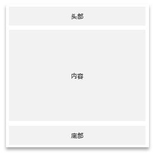
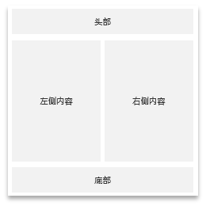
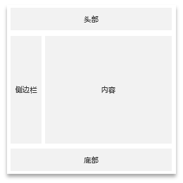
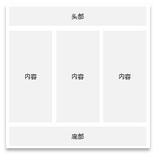
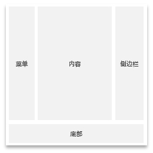
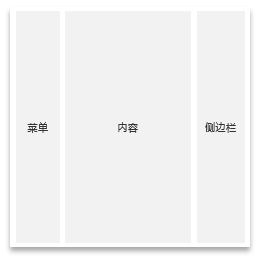
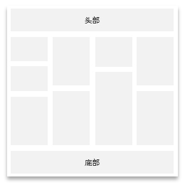

### 单列布局

单列布局即整个页面只有一列，其中包含头部和底部，以及中间内容部分，再无其他。



> 包含头部、中间内容、底部，具体示例：[查看示例](https://www.blogui.cn/design/view.html?pageurl=https://www.blogui.cn/examples/layout-1-1.html)

```html
<div class="wrap">
    <div class="layout">
        <div class="header">
            <div>头部...</div>
        </div>
        <div class="main">
            <div>内容...</div>
        </div>
        <div class="footer">
            <div>底部...</div>
        </div>
    </div>
</div>
```

### 双列布局

双列布局即整个布局内容部分为左右两列，分别包含头部、底部和中间内容部分。

#### 左右平分

> 左右平分布局，双列布局左右平分，内容部分左右各占一半。具体示例：[查看示例](https://www.blogui.cn/design/view.html?pageurl=https://www.blogui.cn/examples/layout-2-1.html)



```html
<body>
    <div class="wrap">
        <div class="layout">
            <div class="header">
                <div>头部</div>
            </div>
            <div class="main row">
                <div class="col-lg-6">左侧内容</div>
                <div class="col-lg-6">右侧内容</div>
            </div>
            <div class="footer">
                <div>底部</div>
            </div>
        </div>
    </div>
</body>
```

#### 左少右多

> 左少右多布局，左少右多布局，内容部分，左边少，右边多。具体示例：[查看示例](https://www.blogui.cn/design/view.html?pageurl=https://www.blogui.cn/examples/layout-2-2.html)



```html
<body>
    <div class="wrap">
        <div class="layout">
            <div class="header">
                <div>头部</div>
            </div>
            <div class="main row">
                <!-- 可以根据自己的需求在这里调整比例 -->
                <div class="col-lg-2">侧边栏</div>
                <div class="col-lg-10">内容</div>
            </div>
            <div class="footer">
                <div>底部</div>
            </div>
        </div>
    </div>
</body>
```

#### 右多左少

> 左多右少布局，左多右少布局，内容部分，左边多，右边少。具体示例：[查看示例](https://www.blogui.cn/design/view.html?pageurl=https://www.blogui.cn/examples/layout-2-3.html)


```html
<body>
    <div class="wrap">
        <div class="layout">
            <div class="header">
                <div>头部</div>
            </div>
            <div class="main row">
                <!-- 可以根据自己的需求在这里调整比例 -->
                <div class="col-lg-10">侧边栏</div>
                <div class="col-lg-2">内容</div>
            </div>
            <div class="footer">
                <div>底部</div>
            </div>
        </div>
    </div>
</body>
```

### 三列布局

#### 三列平分

> 三列布局三列平分含头部、底部。具体示例：[查看示例](https://www.blogui.cn/design/view.html?pageurl=https://www.blogui.cn/examples/layout-3-1.html)



```html
<body>
    <div class="wrap">
        <div class="layout">
            <div class="header">
                <div>头部</div>
            </div>
            <div class="main row">
                <!-- 可以根据自己的需求在这里调整比例 -->
                <div class="col-lg-4">内容左</div>
                <div class="col-lg-4">内容中</div>
                <div class="col-lg-4">内容右</div>
            </div>
            <div class="footer">
                <div>底部</div>
            </div>
        </div>
    </div>
</body>
```

#### 三列布局有脚无头

> 三列布局左少中多右少含底部、无头部。具体示例：[查看示例](https://www.blogui.cn/design/view.html?pageurl=https://www.blogui.cn/examples/layout-3-2.html)



```html
<body>
    <div class="wrap">
        <div class="layout">
            <div class="main row">
                <!-- 可以根据自己的需求在这里调整比例 -->
                <div class="col-lg-2">内容左</div>
                <div class="col-lg-8">内容中</div>
                <div class="col-lg-2">内容右</div>
            </div>
            <div class="footer">
                <div>底部</div>
            </div>
        </div>
    </div>
</body>
```

#### 三列布局无头无脚

> 左少中多含头尾右少平分布局无头部底部，头部底部可以根据需要在内容部分自行实现，这里只提供布局说明。具体示例：[查看示例](https://www.blogui.cn/design/view.html?pageurl=https://www.blogui.cn/examples/layout-3-3.html)



```html
<body>
    <div class="wrap">
        <div class="layout">
            <div class="main row">
                <!-- 可以根据自己的需求在这里调整比例 -->
                <div class="col-lg-2">菜单</div>
                <div class="col-lg-8">内容</div>
                <div class="col-lg-2">侧边栏</div>
            </div>
        </div>
    </div>
</body>
```

### 瀑布流布局

瀑布流布局，即常用的瀑布流布局，这里只提供常见的4列瀑布流。具体示例：[查看示例](https://www.blogui.cn/design/view.html?pageurl=https://www.blogui.cn/examples/layout-4-1.html)



```html
<body>
    <div class="wrap">
        <div class="layout">
            <div class="header">
                <div>头部...</div>
            </div>
            <div class="main falls">
                <div class="column">
                    <!--数字代表可以替换的元素-->
                    <div class="flow">
                        1
                    </div>
                    <div class="flow">
                        2
                    </div>
                    <div class="flow">
                        3
                    </div>
                </div>
                <div class="column">
                    <div class="flow">
                        4
                    </div>
                    <div class="flow">
                        5
                    </div>
                    <div class="flow">
                        6
                    </div>
                </div>
                <div class="column">
                    <div class="flow">
                        7
                    </div>
                    <div class="flow">
                        8
                    </div>
                    <div class="flow">
                        9
                    </div>
                </div>
                <div class="column">
                    <div class="flow">
                        10
                    </div>
                    <div class="flow">
                        11
                    </div>
                    <div class="flow">
                        12
                    </div>
                </div>
            </div>
            <div class="footer">
                <div>底部...</div>
            </div>
        </div>
    </div>
</body>
```

### 自定义布局

> 自定义布局需要自行实现，主要依赖网格布局，具体参考：[网格布局](/layouts?id=网格布局)

### 网格布局

响应式网格布局，顾名思义就是不同设备下可以自适应的布局，主要是通过网格形式控制布局。

#### 主要特点

* 适用于五种不同的屏幕设备尺寸，以实现完全的灵活性。
* 无任何预定义限制、代码简洁带有注释
* 专为响应式网页而设计的网格布局

#### 浏览器兼容

适用于 Chrome、Safari、Firefox、Opera、IE9+

如果您需要在IE8中使用，可以使用 `respond.js polyfill` 进行 `CSS3` 媒体查询和 `REM-unit-polyfill` 进行 `rem untis` 。

#### 网格布局原理

**先了解原理有助于更好的理解和使用**，一般来说可以把网格理解成一个12列的表格，其中包含行和列，把每个网格看成表格的单元格，这样就容易理解一些。但不同的是表格的单元格只能容纳文字、图片、字符等等。但网格是一个容器，可以容纳任何内容。

#### 网格布局对照表

> 提供方便准确的查阅及对照，也可以直接在源码内看注释。

| 属性 | 超小型设备 | 小型设备 | 中型设备 | 大型设备 | 超大型设备 | 超大型设备 |
| --- | --- | --- | --- | --- | --- | --- |
| 设备范围 | 手机 | 平板电脑竖屏模式和大屏手机 | 平板电脑横屏模式 | 笔记本电脑、台式机 | 大屏台式机 | 超大屏台式机 |
| 宽度 | 600px及以下 | 600px及以上 | 768px及以上 | 992px及以上 | 1200px及以上 | 1440px及以上 |
| 样式名 | `.col-xs-*` | `.col-sm-*` | `.col-md-*` | `.col-lg-*` | `.col-xl-*` | `.col-xxl-*` |

#### 网格布局演示

##### 简单使用

> 只展示最基本的使用示例。[查看示例](https://www.blogui.cn/design/view.html?pageurl=https://www.blogui.cn/examples/layout-grid.html)

```html
<body>
    <!--使用默认的wrap布局先包一层-->
    <div class="wrap">
        <!---mq是查询命令，在不同的分辨率下颜色会不同-->
        <h3 class="-mq">默认为12格，需要进行分割，这里演示不同设备下6:6的分割网格布局，直接浏览器内F12查看</h3>
        <!--包含在.row的DIV层内-->
        <div class="row">
            <h4>电脑</h4>
            <div class="col-lg-6" style="background: #ddd;">x-6-desktop</div>
            <div class="col-lg-6" style="background:#eee;">x-6-desktop</div>
        </div>
    </div>
</body>
```

##### 所有网格布局

> 演示包含所有网格布局（包含不同分辨率下的呈现效果）。[查看示例](https://www.blogui.cn/design/view.html?pageurl=https://www.blogui.cn/examples/layout-grid-base.html)

```html
<body>
    <div class="wrap">
        <h3 class="-mq" align="center">网格默认为12格，这里演示12格的不同组合，直接浏览器内F12查看</h3>
        <br />
        <div class="row">
            <h4>这里演示网格布局桌面电脑下全屏效果</h4>
            <div class="col-lg-12" style="background: #ddd;">全屏</div>
        </div>
        <div class="row">
            <h4>这里演示网格布局桌面电脑下1:11</h4>
            <div class="col-lg-1" style="background: #ddd;">1</div>
            <div class="col-lg-11" style="background:#eee;">11</div>
        </div>
        <div class="row">
            <h4>这里演示网格布局桌面电脑下2:10</h4>
            <div class="col-lg-2" style="background: #ddd;">2</div>
            <div class="col-lg-10" style="background:#eee;">10</div>
        </div>
        <div class="row">
            <h4>这里演示网格布局桌面电脑下3:9</h4>
            <div class="col-lg-3" style="background: #ddd;">3</div>
            <div class="col-lg-9" style="background:#eee;">9</div>
        </div>
        <div class="row">
            <h4>这里演示网格布局桌面电脑下4:8</h4>
            <div class="col-lg-4" style="background: #ddd;">4</div>
            <div class="col-lg-8" style="background:#eee;">8</div>
        </div>
        <div class="row">
            <h4>这里演示网格布局桌面电脑下5:7</h4>
            <div class="col-lg-5" style="background: #ddd;">5</div>
            <div class="col-lg-7" style="background:#eee;">7</div>
        </div>
        <div class="row">
            <h4>这里演示网格布局桌面电脑下6:6</h4>
            <div class="col-lg-6" style="background: #ddd;">6</div>
            <div class="col-lg-6" style="background:#eee;">6</div>
        </div>
        <div class="row">
            <h4>这里演示网格布局桌面电脑下7:5</h4>
            <div class="col-lg-7" style="background: #ddd;">7</div>
            <div class="col-lg-5" style="background:#eee;">5</div>
        </div>
        <div class="row">
            <h4>这里演示网格布局桌面电脑下8:4</h4>
            <div class="col-lg-8" style="background: #ddd;">8</div>
            <div class="col-lg-4" style="background:#eee;">4</div>
        </div>
        <div class="row">
            <h4>这里演示网格布局桌面电脑下9:3</h4>
            <div class="col-lg-9" style="background: #ddd;">9</div>
            <div class="col-lg-3" style="background:#eee;">3</div>
        </div>
        <div class="row">
            <h4>这里演示网格布局桌面电脑下10:2</h4>
            <div class="col-lg-10" style="background: #ddd;">10</div>
            <div class="col-lg-2" style="background:#eee;">2</div>
        </div>
        <div class="row">
            <h4>这里演示网格布局桌面电脑下11:1</h4>
            <div class="col-lg-11" style="background: #ddd;">11</div>
            <div class="col-lg-1" style="background:#eee;">1</div>
        </div>
    </div>
</body>
```

##### 隐藏和显示

有时候我们需要显示或隐藏网格内容的情况。这个时候就可以使用以下样式来完成。

| 属性 | 超小型设备 | 小型设备 | 中型设备 | 大型设备 | 超大型设备 | 超大型设备 |
| --- | --- | --- | --- | --- | --- | --- |
| 设备范围 | 手机 | 平板电脑竖屏模式和大屏手机 | 平板电脑横屏模式 | 笔记本电脑、台式机 | 超大屏台式机 |
| 显示 | `.show-xs` | `.show-sm` | `.show-md` | `.show-lg` | `.show-xl` | `.show-xxl` |
| 隐藏 | `.hide-xs` | `.hide-sm` | `.hide-md` | `.hide-lg` | `.hide-xl` | `.hide-xxl` |

> 只需要将对应的样式添加到需要使用的元素 `class` 属性上即可。[查看示例](https://www.blogui.cn/design/view.html?pageurl=https://www.blogui.cn/examples/layout-grid-display.html)

```html
<body>
    <!--使用默认的wrap布局先包一层-->
    <div class="wrap -mq">
        <div class="show-lg hide-xs">桌面电脑下你看的到，手机下看不到</div>
        <div class="hide-lg show-xs">桌面电脑下看不到，手机下看的到</div>
        <div class="show-xs hide-lg">手机下可见</div>
        <div class="hide-xs show-lg">手机下你看不到的</div>
    </div>
</body>
```

#### Flex弹性布局

`Flex` 是 `Flexible Box` 的缩写，意为“弹性布局”或者“弹性盒子”，是 `CSS3` 中的一种新的布局模式，可以简便、完整、响应式地实现各种页面布局，当页面需要适应不同的屏幕大小以及设备类型时非常适用。

> 由于博客站长多数是新手，在博客类系统中实际使用也不多，这个版本就不在做详细阐述和介绍，

最后更新： 2022-01-10

---
